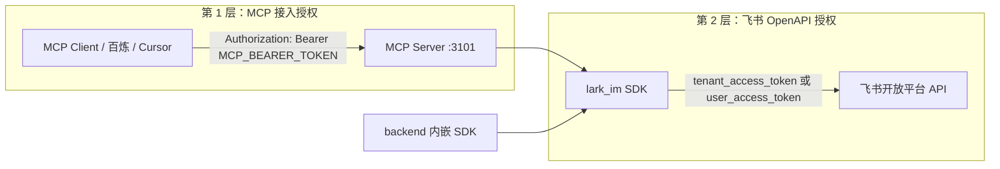
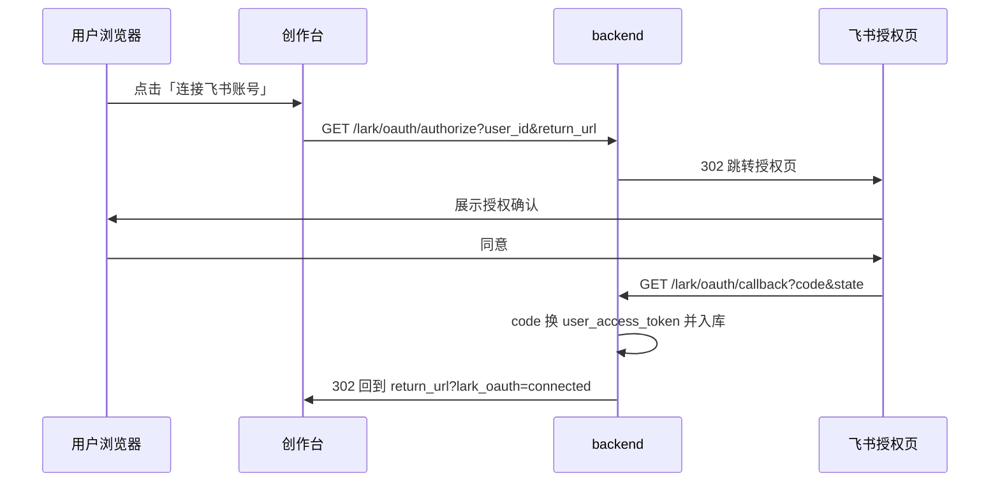

# 飞书 IM MCP 对外接入手册

面向 **外部 MCP Client 开发者**（百炼 Agent、Cursor、自研 Agent），说明如何连接 `lark-im` MCP Server，以及在内容审核通过后引导用户推送到飞书。

## 概述

| 组件 | 说明 |
|------|------|
| `lark_im` SDK | Python 包：发消息、搜群、审核通过通知模板等 |
| MCP Server (`server`) | Streamable HTTP MCP，默认 `http://0.0.0.0:3101/mcp` |
| Backend 内置 | 创作台 `backend` 进程内嵌 `lark_im`，审核通过时可自动推送（无需单独部署 MCP） |

**两种使用场景：**

1. **创作台自动通知**：运维在 `backend/.env` 配置 `LARK_*`，Reviewer 通过后由 orchestrator 自动或按需推送。
2. **百炼 / Cursor 调工具**：部署 `mcp-lark` HTTP 服务，Client 通过 `streamableHttp` + Bearer 连接。

## 授权体系

本方案涉及 **两层授权**，不要混用或遗漏任一层：



| 层级 | 谁校验 | 凭证放在哪 | 典型失败表现 |
|------|--------|------------|--------------|
| **MCP 接入** | MCP Server（FastMCP Bearer） | `mcp-lark/.env` 的 `MCP_BEARER_TOKEN`；Client 配置 `headers.Authorization` | `401 Unauthorized`、连接被拒绝、`tools/list` 失败 |
| **飞书 API** | 飞书开放平台 | `backend/.env` 或 `mcp-lark/.env` 的 `LARK_*` | `bot.available: false`、发消息 4xx、`Lark API error` |

**创作台自动推送**只走第 2 层（backend 内嵌 `lark_im`），**不需要**第 1 层。百炼 / Cursor 调 MCP 工具需要两层都配好。

### 第 1 层：MCP HTTP Bearer 授权

MCP Server 使用静态 Bearer Token（`server/auth.py` → FastMCP `StaticTokenVerifier`）。

1. 在 `mcp-lark/.env` 设置 **≥16 字符**随机串：

```env
MCP_BEARER_TOKEN=请替换为长随机串-至少16字符
```

2. MCP Client 每次请求携带：

```http
Authorization: Bearer <与 MCP_BEARER_TOKEN 完全一致>
```

3. **不要**把 `MCP_BEARER_TOKEN` 写进前端或公开仓库；百炼侧填在 Agent「HTTP 头 / headers」配置里。

4. 校验方式：无 Token 或 Token 错误时，Client 无法 `tools/list` / `tools/call`；`GET /health` 通常仍可访问（健康检查不走 MCP 鉴权）。

### 第 2 层：飞书 OpenAPI 授权（三种路径）

| 路径 | 适用场景 | 凭证来源 | 云上推荐 |
|------|----------|----------|----------|
| **A. Bot（方案 3）** | 个人账号 + lark-cli 同款应用上云 | `LARK_APP_ID` + `LARK_APP_SECRET` → `tenant_access_token` | ✅ 推荐 |
| **B. lark-cli 用户** | 本机开发、无 App Secret | `lark-cli auth login` 登录态 | ❌ 容器/云上不可用 |
| **C. User Token** | 需以用户身份发消息 | `LARK_USER_ACCESS_TOKEN`（OAuth 换取） | 可选，本期未实现自动刷新 |

`lark_im` 选择逻辑：

- `LARK_USE_CLI=false` 且配置了 App ID/Secret → 走 **A**
- 未配置 App 且本机有 `lark-cli` 登录 → 走 **B**（`LARK_USE_CLI` 未设时自动）
- `LARK_DEFAULT_IDENTITY=user` 且配置了 User Token → 走 **C**

### 方案 3：Bot 授权完整流程（云上必做）

这是 **飞书侧授权**，与 MCP Bearer 无关，但 **backend 自动通知与 MCP 发消息都依赖它**。

#### 步骤 1：确认应用与凭证

1. 打开 [飞书开放平台](https://open.feishu.cn/app) → 进入应用（可与 `lark-cli config` 中 App ID 相同，如 `cli_xxx`）。
2. **凭证与基础信息** → 复制 **App ID**、**App Secret**。
3. 写入服务器 `backend/.env`（创作台推送）或 `mcp-lark/.env`（MCP 独立部署）：

```env
LARK_APP_ID=cli_xxx
LARK_APP_SECRET=你的Secret
LARK_DEFAULT_IDENTITY=bot
LARK_USE_CLI=false
```

#### 步骤 2：开通 API 权限并发布

在应用 **权限管理** 中申请以下权限，并 **创建版本 → 申请发布 → 管理员审核通过**（未发布则 API 仍报无权限）：

| 权限标识 | 用途 |
|----------|------|
| `im:message` | 机器人向群聊发送消息 |
| `im:message:readonly` | 读取群消息、搜索群聊 |

可选（按业务扩展）：`im:chat:readonly` 等，本仓库 IM 工具以以上两项为最小集。

#### 步骤 3：获取 tenant_access_token（Bot 令牌）

SDK 内部调用飞书接口自动换取，无需手工维护：

```http
POST https://open.feishu.cn/open-apis/auth/v3/tenant_access_token/internal
Content-Type: application/json

{"app_id": "<LARK_APP_ID>", "app_secret": "<LARK_APP_SECRET>"}
```

成功返回 `tenant_access_token`（约 2 小时有效，SDK 会缓存并在过期前刷新）。失败常见原因：App ID/Secret 错误、应用被停用。

#### 步骤 4：机器人进群（资源授权）

Bot 凭证正确 **不等于** 能向任意群发消息。目标群必须 **添加该应用的机器人成员**：

1. 飞书客户端 → 目标群 → **群设置 → 群成员 → 添加成员**。
2. 搜索 **应用名称**（开放平台上的应用名，不是个人昵称）。
3. 添加成功后，将群 `chat_id`（`oc_` 开头）写入：

```env
LARK_NOTIFY_CHAT_ID=oc_xxx
```

可用 MCP 工具 `search_chats`（须先完成第 1、2 层授权）按群名查询 `chat_id`。

#### 步骤 5：验证 Bot 授权是否生效

**方式一 — MCP 工具**（百炼 / Cursor）：

```text
tools/call get_lark_auth_status
```

期望：`bot.configured: true`，`bot.available: true`，`bot.error` 为 null。

**方式二 — 创作台 Backend API**：

```bash
curl -s http://localhost:8000/lark/status | jq .
```

**方式三 — 本机 Python**：

```bash
python -c "
import asyncio
from lark_im import get_lark_im_service
async def main():
    print(await get_lark_im_service().get_auth_status())
asyncio.run(main())
"
```

### 本机开发：lark-cli 用户授权（路径 B）

仅适合 **本机** 未配置 `LARK_APP_ID` / `LARK_APP_SECRET` 时：

```bash
npm i -g @larksuite/lark-cli
lark-cli config init
lark-cli auth login --scope "im:message im:message.send_as_user im:message:readonly"
```

授权数据保存在本机，**不会**随代码部署到云服务器。云上请改用方案 3 Bot。

### 网页 OAuth 授权（路径 D，推荐 Studio 个人推送）

无需手工复制 `user_access_token`。用户点击「连接飞书账号」后，浏览器 **自动跳转飞书授权页**，同意后回流并保存 token（支持 `refresh_token` 刷新）。

#### 前置配置（运维）

1. 飞书开放平台 → **安全设置** → **重定向 URL** 添加固定回调（与 `.env` 一致）：

```text
http://你的后端域名/lark/oauth/callback
```

2. `backend/.env`：

```env
LARK_OAUTH_REDIRECT_URI=http://localhost:8000/lark/oauth/callback
LARK_OAUTH_SCOPES=offline_access
LARK_OAUTH_STUDIO_REDIRECT_URIS=http://localhost:3000/studio,http://47.100.107.192:3000/studio
```

`LARK_OAUTH_STUDIO_REDIRECT_URIS` 为创作台授权完成后的业务回流地址（须在 DCR 客户端 `redirect_uris` 白名单内）。

#### 动态客户端注册（DCR）

本系统在飞书 OAuth 之上提供 **RFC 7591 风格** 的客户端登记（登记的是业务 `return_url`，不是飞书 App 本身）：

```bash
curl -s -X POST http://localhost:8000/lark/oauth/register \
  -H 'Content-Type: application/json' \
  -d '{
    "client_name": "my-agent",
    "redirect_uris": ["http://localhost:3000/studio"]
  }'
```

响应含 `client_id`（`oac_` 前缀）、`client_secret`、`redirect_uris`。后续授权须使用已登记的 `return_url`。

创作台默认客户端 `oac_studio_default` 在配置了 `LARK_OAUTH_STUDIO_REDIRECT_URIS` 时由服务启动自动种子注册。

#### OAuth 授权流程



| API | 说明 |
|-----|------|
| `POST /lark/oauth/register` | 动态客户端注册（DCR） |
| `GET /lark/oauth/authorize` | 302 到飞书授权页 |
| `GET /lark/oauth/callback` | 飞书回调（固定 URI，须在开放平台登记） |
| `GET /lark/oauth/user?user_id=` | 查询用户是否已授权 |
| `DELETE /lark/oauth/user?user_id=` | 解除授权 |

推送时 `POST /lark/push-review` 携带 `user_id` 将使用已保存的 **用户身份** 发消息；未带 `user_id` 时仍走 Bot（`LARK_NOTIFY_CHAT_ID`）。

### User Token 手工配置（路径 C，遗留）

若 `LARK_DEFAULT_IDENTITY=user`，也可在 `.env` 静态配置 `LARK_USER_ACCESS_TOKEN`。推荐使用上文 **路径 D OAuth** 代替手工粘贴 token。

### 创作台 `/lark/*` API 说明

`GET /lark/status`、`POST /lark/push-review` 由 **frontend-share Studio** 在同源或内网调用，**当前未单独要求用户登录或 Bearer**。部署到公网时建议：

- 仅内网暴露 backend，或
- 在前置网关 / 反向代理增加鉴权（不在本期范围）

### 授权相关故障排查

| 现象 | 层级 | 处理 |
|------|------|------|
| MCP `401` / 无法 `tools/list` | 第 1 层 | 检查 Client `Authorization` 与 `MCP_BEARER_TOKEN` 是否一致、Token 长度 ≥16 |
| `bot.available: false`，`LARK_APP_ID / LARK_APP_SECRET 未配置` | 第 2 层 | 补全 `.env` 中 App 凭证 |
| `bot.available: false`，`Lark API error` 含 `app secret invalid` | 第 2 层 | Secret 错误或与 App ID 不匹配 |
| `Lark API error` 含 `99991663` / `permission denied` / 无权限 | 第 2 层 | 开放平台权限未开通或未 **发布** |
| 发消息失败，提示机器人不在群内 / `230002` 等 | 第 2 层 | 将应用机器人加入目标群 |
| 云上发消息失败但本机 CLI 可用 | 路径 | 云上不能用 lark-cli 登录态，改方案 3 Bot |
| `LARK_USER_ACCESS_TOKEN 未配置` | 第 2 层 | 改 `LARK_DEFAULT_IDENTITY=bot`，或配置 User Token |
| `tenant token` 曾成功后又失败 | 第 2 层 | Secret 被轮换、应用被停用；重新检查开放平台凭证 |
| OAuth 回调 `redirect_uri 不匹配` | OAuth | `LARK_OAUTH_REDIRECT_URI` 须与开放平台登记、换 token 时一致 |
| 授权后回到 Studio 报 `return_url 不在白名单` | DCR | 先 `POST /lark/oauth/register` 或配置 `LARK_OAUTH_STUDIO_REDIRECT_URIS` |
| `用户未完成飞书授权` | OAuth | Studio 点击「连接飞书账号」完成授权 |

## 快速接入

### 1. 部署 MCP Server（仅 Client 调工具时需要）

```bash
cd mcp-lark
pip install -e ".[mcp]"
cp .env.example .env   # 编辑 MCP_BEARER_TOKEN、LARK_* 等
python -m server
```

健康检查：`GET http://127.0.0.1:3101/health` → `{"status":"ok"}`

### 2. MCP Client 连接 JSON

```json
{
  "mcpServers": {
    "lark-im": {
      "url": "http://127.0.0.1:3101/mcp",
      "type": "streamableHttp",
      "headers": {
        "Authorization": "Bearer <MCP_BEARER_TOKEN>"
      }
    }
  }
}
```

调用方式为 MCP 规范 `tools/call`，不是 REST。

完整百炼表单示例见 [`BAILEIAN_EXAMPLE.json`](./BAILEIAN_EXAMPLE.json)。

## 百炼 Agent 配置要点

- **安装方式**：`http`
- **URL**：`https://你的域名/mcp`（或内网 `http://IP:3101/mcp`）
- **type**：`streamableHttp`
- **headers**：`Authorization: Bearer <MCP_BEARER_TOKEN>`（见上文 **第 1 层：MCP HTTP Bearer 授权**）

## 鉴权模式速查：方案 3 Bot（云上推荐）

云上 **不使用** `lark-cli` 登录态。完整步骤见上文 **方案 3：Bot 授权完整流程**；此处为环境变量速查：

```env
LARK_APP_ID=cli_xxx
LARK_APP_SECRET=你的Secret
LARK_DEFAULT_IDENTITY=bot
LARK_USE_CLI=false
LARK_NOTIFY_CHAT_ID=oc_xxx
LARK_NOTIFY_ENABLED=true
LARK_NOTIFY_MODE=auto
```

本地开发无 App 凭证时可走 **lark-cli 用户授权**（见上文路径 B）。

## 环境变量

| 变量 | 说明 |
|------|------|
| `MCP_BEARER_TOKEN` | MCP HTTP Bearer 鉴权（≥16 字符），**仅 MCP Server** |
| `LARK_APP_ID` | 飞书应用 App ID |
| `LARK_APP_SECRET` | 飞书应用 App Secret |
| `LARK_NOTIFY_CHAT_ID` | 审核通知目标群 `chat_id`（`oc_` 开头） |
| `LARK_NOTIFY_ENABLED` | `true` 时允许推送（与 `LARK_NOTIFY_MODE` 配合） |
| `LARK_NOTIFY_MODE` | `auto`：通过后自动推送；`prompt`：仅元数据，由 UI/MCP 确认；`off`：关闭 |
| `LARK_DEFAULT_IDENTITY` | `bot` 或 `user` |
| `LARK_USE_CLI` | `false` 强制 OpenAPI；未设且无 `LARK_APP_ID` 时走 CLI |
| `LARK_USER_ACCESS_TOKEN` | 用户身份 access token（可选） |

**勿将 `LARK_APP_SECRET` 写入 MCP Client 配置或前端。**

## MCP Tools 契约

| Tool | 只读 | 说明 |
|------|------|------|
| `send_message` | 否 | 向群聊发 text / markdown |
| `reply_message` | 否 | 回复指定消息 |
| `list_chat_messages` | 是 | 拉取群最近消息 |
| `search_chats` | 是 | 按名称搜群 |
| `get_lark_auth_status` | 是 | 检查 bot / user 凭证是否可用 |
| `notify_review_passed` | 否 | 发送审核通过通知（须用户确认后调用） |
| `get_lark_setup_guide` | 是 | 返回开放平台配置步骤（不含 Secret） |

## 审核通过集成流程

### 创作台 SSE / API 结果字段

生成结果 `result` 在审核执行后包含：

```json
{
  "review_approved": true,
  "review_feedback": "…",
  "lark_notification": {
    "eligible": true,
    "mode": "auto",
    "configured": true,
    "auto_sent": false,
    "error": null,
    "prompt": "审核已通过。是否推送到飞书？"
  }
}
```

### MCP Agent 推荐工作流

1. 读取生成结果中的 `review_approved` 与 `lark_notification`
2. 若 `review_approved === true` 且未 `auto_sent`，向用户展示 `lark_notification.prompt` 并询问是否推送
3. 调用 `get_lark_auth_status`，确认 `bot.available === true`
4. 用户明确确认后，调用 `notify_review_passed`（参数与生成结果字段对齐）

### Studio HTTP API（可选）

| 路由 | 说明 |
|------|------|
| `GET /lark/status` | 鉴权状态 + 是否已配置通知群 |
| `POST /lark/push-review` | 显式推送审核通过通知 |

## 安全

- **两层授权分离**：MCP Bearer 保护 MCP 入口；飞书 Secret 仅用于换取 `tenant_access_token`，二者职责不同
- MCP 使用 Bearer Token；定期轮换 `MCP_BEARER_TOKEN`
- **发送消息前必须经用户确认**（`send_message`、`notify_review_passed`）
- `LARK_APP_SECRET` 仅存服务器 `.env`，不进 MCP Client 配置、不进前端
- 飞书权限变更后需重新 **发布应用版本**，否则 API 仍报无权限

## 故障排查（非授权类）

| 现象 | 处理 |
|------|------|
| 3101 连不上 | MCP 服务未部署；创作台自动通知不依赖 3101 |
| 自动通知不生效 | 检查 `backend/.env` 中 `LARK_NOTIFY_ENABLED` 与 `LARK_NOTIFY_MODE` |
| `LARK_NOTIFY_CHAT_ID 未配置` | 用 `search_chats` 查群名，写入 `LARK_NOTIFY_CHAT_ID` |

授权类问题见上文 **授权相关故障排查** 表。

## 相关文档

- 包内 README：[`../README.md`](../README.md)
- Docker：`docker-compose.mcp.yml`（根目录 monorepo）
