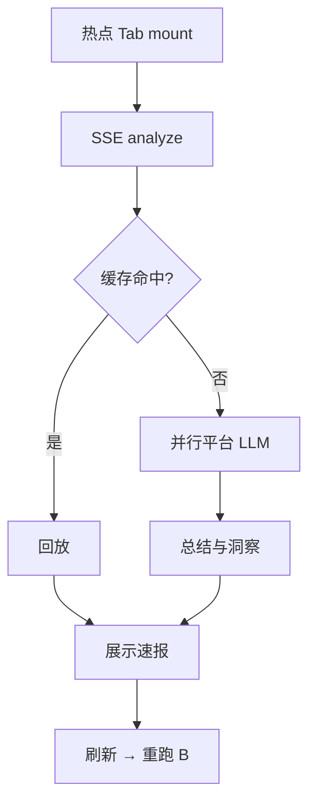

# 热点分析

五平台（微博、小红书、抖音、X、Reddit）商品宣传热点 LLM 分析，SSE 流式返回；结果内存缓存 5 分钟。

**入口**：`/studio` → 侧栏「热点分析」

> **边界**：`SocialSyncSettings`（侧栏微博/X 登录）非本功能，仅共用 `/studio` 布局。

---

## Agent 阅读指引

> 通用规范：[`project-map` skill](../.agents/skills/project-map/SKILL.md) · 索引：[`README.md`](README.md)

| 层级 | 关注点 | 路径 |
|------|--------|------|
| 数据库 | 无持久化表；进程内缓存 | `hotspot_job_store.py` |
| 后端 | SSE `/social-hotspots/analyze/stream` | `backend/app/services/social_hotspot/` |
| 前端 | mount 自动 stream · Route Handler 代理 | `social-hotspot-analysis.tsx` · `app/social-hotspots/` |

状态：组件内 `useState` + SSE 解析 · `AbortController` 卸载取消 · 无 Redux/Zustand。

---

## 用户动线



| 操作 | 调用链 |
|------|--------|
| 进入 / 刷新 | `POST /social-hotspots/analyze/stream`（SSE） |
| 进度 | 事件 `log` · `platform_hotspots` |
| 结果 | `summary` · `cross_platform` · `insights` · `data_source` · `result` |

前端传空 `{}`；后端默认 keyword 与五平台。Strict Mode 下可能见第一次请求 canceled。

---

## 数据库层

本功能**无** SQL/Prisma。`HotspotResultCache`：`keyword + platforms` → SSE 事件列表，TTL 默认 300s（`SOCIAL_HOTSPOT_CACHE_TTL_SEC`）。

---

## 后端层

| 入口 | 说明 |
|------|------|
| `POST /social-hotspots/analyze/stream` | SSE；`SOCIAL_HOTSPOT_ENABLED=false` → 503 |

DTO `HotspotAnalyzeRequest`（`schemas.py`）：`keyword` · `platforms` · `max_items_per_platform` · `locale`

```
stream_analysis_events → 查缓存 → 未命中：并行 analyze_platform
  → aggregate_synthesis → push 各 SSE 事件 → 写缓存
```

模块：`hotspot_service.py` · `hotspot_aggregator.py` · `hotspot_job_store.py`

**现状**：`snippets=[]`，无实时检索；LLM 推断，不足时标注模拟数据。

---

## 前端层

```
studio-app.tsx · components/social-hotspot-analysis.tsx
services/api.ts（streamSocialHotspotsAnalyze）
lib/sse/sse-parser.ts
app/social-hotspots/analyze/stream/route.ts   代理 SSE，超时 10 分钟
```

SSE **必须** Route Handler；`next.config` 未 rewrite 此路径。

### SSE 事件

| type | 用途 |
|------|------|
| `log` | 进度 |
| `platform_hotspots` | 单平台卡片 |
| `summary` / `cross_platform` / `insights` / `data_source` | 汇总 |
| `result` | 完整 `HotspotAnalysisResult` |
| `error` | 失败 Alert |

---

## 勿做 / 常见幻觉

- 勿把热点 SSE 放进 `next.config` rewrite
- 勿与 `GET /social/status` 微博同步混为一谈
- 勿假设已有实时网页检索（当前 snippets 为空）

---

## 测试

| 类型 | 位置 |
|------|------|
| 后端 | `backend/tests/test_hotspot_api.py` |
