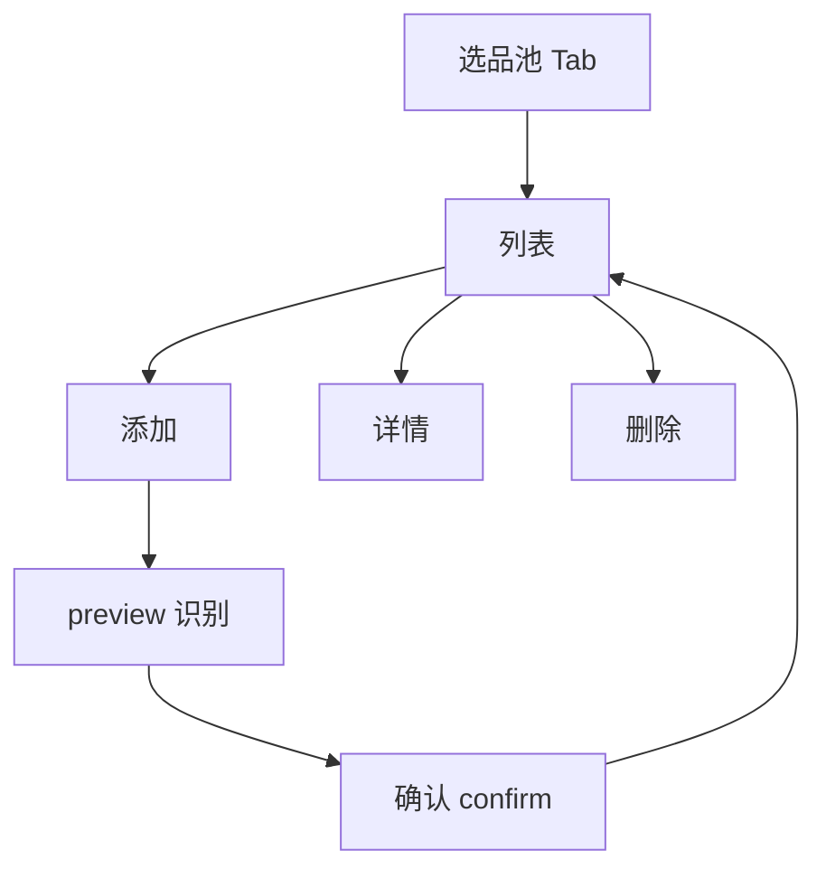

# 选品池

淘宝/天猫/京东链接导入商品，预览确认后入库；支持列表、详情、删除。入库同步 CSV + RAG 索引。

**入口**：`/studio` → 侧栏「选品池」

---

## Agent 阅读指引

> 通用规范：[`project-map` skill](../.agents/skills/project-map/SKILL.md) · 索引：[`README.md`](README.md)

| 层级 | 关注点 | 路径 |
|------|--------|------|
| 数据库 | CSV 文件 + Chroma 索引（非 PostgreSQL） | `product_rag_system/data/` |
| 后端 | FastAPI `/product_info/*` · 抓取 + LLM 提取 | `backend/app/services/product_info_service.py` |
| 前端 | `product-pool.tsx` · Route Handler 长超时代理 | `frontend-share/src/app/product_info/` |

状态：`useActionState`（load/preview/confirm/delete）· 无 Redux/Zustand。

---

## 用户动线



| 操作 | 调用链 |
|------|--------|
| 列表 | `GET /product_info/list` |
| 添加 | `POST /product_info/preview` → `POST /product_info/confirm` |
| 详情 | `GET /product_info/{id}` |
| 删除 | `DELETE /product_info/{id}` |

`preview` 不入库，返回 `preview_token`（内存 10 分钟）；`confirm` 才写 CSV + 更新 Chroma。

---

## 数据库层

本功能**无** SQL 表；持久化为文件 + 向量库。

```
taobao_products.csv     主数据（名称、价格、类别、摘要…）
scraped_products.csv      爬虫明细（头图、评论…）
product_rag_system/       Chroma 检索索引（入库/删除时同步）
```

读写：`product_info_service.py` · 模型 `ProductItem`（`schemas.py`）

---

## 后端层

| 方法 | 路径 | 说明 |
|------|------|------|
| GET | `/product_info/list` | 列表 |
| POST | `/product_info/preview` | 识别预览 |
| POST | `/product_info/confirm` | 凭 token 入库 |
| GET | `/product_info/{id}` | 详情 |
| DELETE | `/product_info/{id}` | 删除 |

```
链接校验 → Playwright 抓取 → LLM 结构化 → preview 缓存 token
confirm → 写 CSV + 更新 RAG
```

---

## 前端层

```
studio/studio-app.tsx · components/product-pool.tsx
services/api.ts（listProducts / preview / confirm / get / delete）
app/product_info/[...path]/route.ts   代理后端，超时 5 分钟
```

识别走 Route Handler，**不可**仅依赖 rewrite（耗时长）。

---

## 勿做 / 常见幻觉

- 勿把商品数据写入 Prisma / Python `projects` 表
- 勿在 preview 阶段直接入库
- 勿去掉 `product_info` Route Handler 改纯 rewrite

---

## 测试

| 类型 | 位置 |
|------|------|
| E2E | `frontend-share/e2e/product-pool.spec.ts` |
| 后端 | `backend/tests/test_product_info_service.py` · `test_product_rag.py` |
